# Draft: Differential-Drive Lane Following — PID vs LQR

<p align="center">
  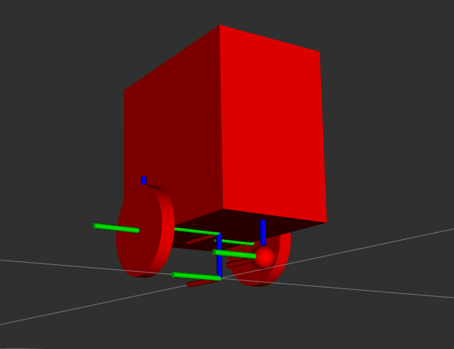
</p>

**Designing a control system for an existing robot, from requirements to a controller comparison.**

A differential-drive robot follows a closed reference path in closed loop on a **full dynamic model**: kinematics *and* coupled motor dynamics. Two controllers are synthesised on the same model and compared under identical conditions:
- **LQR** state-feedback law
- **cascade PID**.

The point of the project is not "a robot that drives." It is the reasoning *upstream* of the code: which requirements the platform has to meet, how the physical parameters are derived and how much they can be trusted, why the model looks the way it does, and how two controllers behave.

`Python` · `C++` · `ROS 2 Humble` · `Gazebo Classic` · `ros2_control`

---

## At a glance

| | |
|---|---|
| **Task** | Track a stadium-shaped path, starting off-path, correcting lateral + heading error |
| **Plant** | Coupled two-motor model + shared chassis mass and yaw inertia, derived from scratch |
| **Controllers** | LQR (one gain matrix on the full 4-state vector) vs cascade PID (3 decoupled SISO loops) |
| **Metrics** | mean / max tracking error, convergence time, RMS command effort |
| **Robustness** | Gains frozen on the design model, then the least-reliable parameters (J) mismatched in the simulation model, measuring how each controller tolerates the error |
| **What it shows** | Requirements analysis · motor & system-dynamics modelling · control-loop design · design trade-offs · real-time embedded implementation |

The full derivations live in [`docs/`](#documentation). This README is the map.

---

## Design approach

The brief:

> *You are given an existing system. Specify the requirements it should meet, analyse its components and their trade-offs, then design and compare controllers on it.*

Concretely that means:

1. **Requirements are posed** (Soon) Each has a stated role in the study rather than being read off a datasheet after the fact — see [`docs/requirements.md`](docs/requirements.md).
2. **Every physical parameter carries its derivation chain, its uncertainty** — see [`platform_constraints.md`](platform_constraints.md).
3. **Simplifications are documented as decisions.** Neglecting armature inductance; the uncertainty on `R`.

---

## Project phases

Each phase is a quantitative acceptance gate before the next one starts.

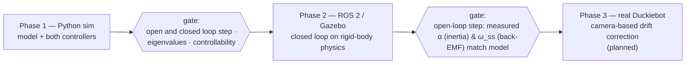

---

## System model

State and input:

```
x = [ e_l , e_theta , omega_L , omega_R ]        u = [ V_L , V_R ]
```

- `e_l` and `e_theta` are the lateral and heading error to the path
- `omega_L`, `omega_R` are the wheel speeds.
The linearised model around a constant reference speed is a standard LTI system `x_dot = A x + B u`.

<p align="center">
  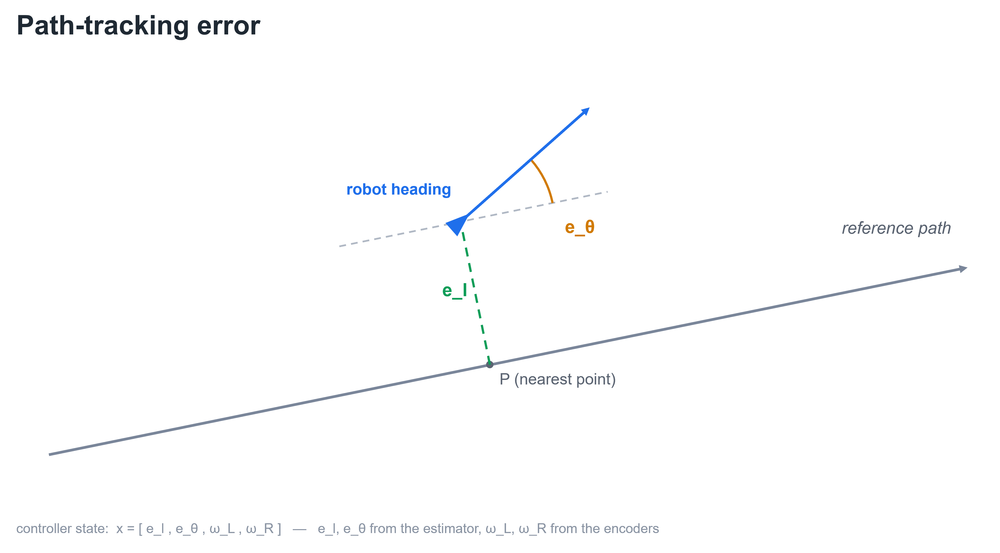
</p>

**Motor dynamics** Each wheel obeys

```
J · omega_dot = (Kt/R) · V  −  (Kt·Ke/R) · omega
                               back-EMF
```

- **The back-EMF term is the rotor's own damping.** It appears by substituting the armature current `i = (V − Ke·omega)/R` into `J·omega_dot = Kt·i`. In the Gazebo implementation it is carried by the joint's ODE damping (`b = Kt·Ke/R`).
- **The dominant inertia is the rotor reflected through the gearbox, not the wheel.** A 1:48 reduction amplifies rotor inertia by **N²** at the output, so `J ≈ 2.5×10⁻⁴ kg·m²` is ~90 % reflected rotor and only ~10 % physical wheel. That makes `J` the least-reliable parameter in the whole model and therefore priority #1 in the robustness test.

Full derivation in [`docs/system_model.md`](docs/system_model.md), reproducible with [`compute_matrices.py`](compute_matrices.py).

---

## ROS 2 architecture

Four nodes, one direction of flow, plus the feedback loop that closes through Gazebo's physics. Estimator and controller are architecturally separated: `path_error_node` knows nothing about the controller, and the controller knows nothing about the path geometry beyond the curvature `kappa` it is passed on. Swapping LQR for PID touches neither the estimator nor the plant.

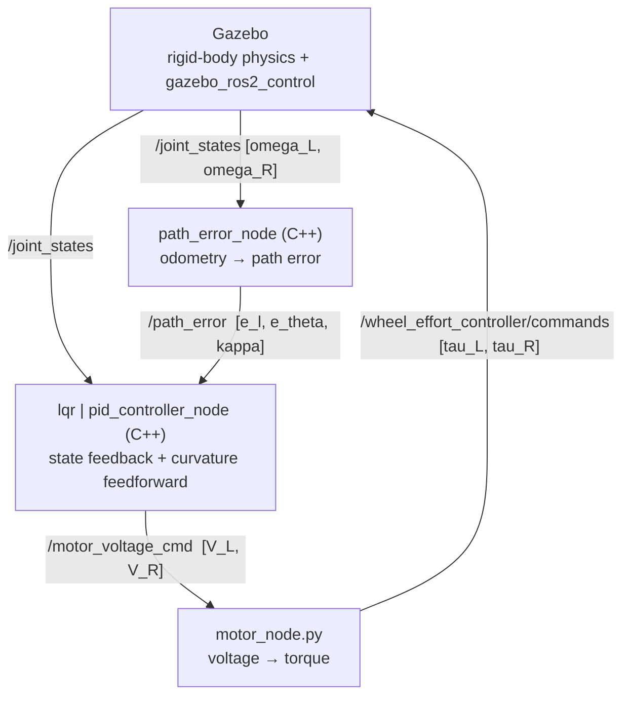

The loop is **driven by the measurement, not by a ROS timer**. Running every node on the arrival of `/joint_states` (~985 Hz, decimated to ~197 Hz in the controllers). The node-level implementation details are in the package README under [`ros2_ws/src/duckiebot/`](ros2_ws/src/duckiebot/README.md).

---

## Controllers: LQR vs PID

Both share the **same feedforward**: the nominal per-wheel voltage `V_nom(kappa)` that would drive the path perfectly with zero error so the comparison is strictly between the two **feedback** strategies. In both, the control signal is a *deviation* from `V_nom`, not an absolute voltage.

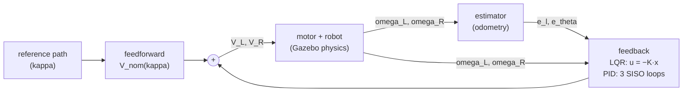

**LQR** treats the four states together: a single matrix `K` (computed offline via python script) takes into account the cross-couplings between lateral and heading error and the two wheel speeds in one shot.

<p align="center">
  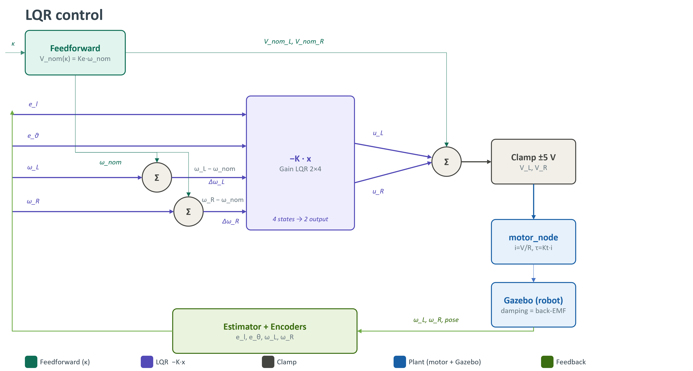
</p>

**PID** deliberately ignores those couplings: a cascade (position → heading) drives the *differential* mode, a PI regulates the *common* (speed) mode, and the two are recomposed as `V_L = V_nom_L + V_avg − V_rot`, `V_R = V_nom_R + V_avg + V_rot`

<p align="center">
  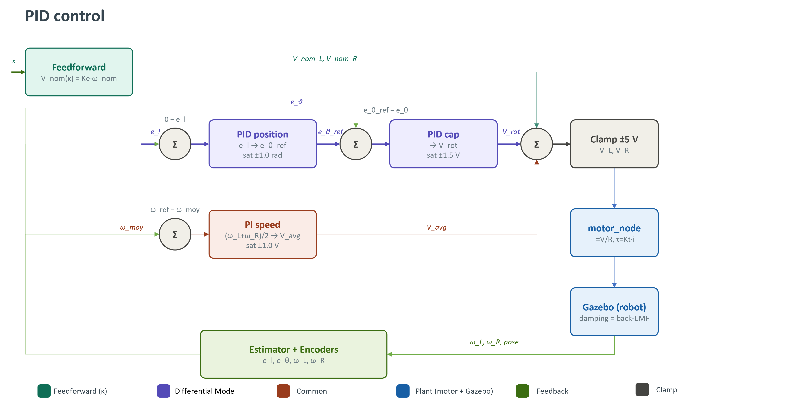
</p>

---
## Controller simultation: Python vs ROS2/Gazebo

The state-space model was first validated in a standalone Python integration of ẋ = Ax + Bu before the ROS 2 development.
Overall, the Python simulation matches Gazebo: the two agree in the small-angle regime, which is the regime the comparison runs in.

| Python (`ẋ = Ax + Bu`) | Gazebo (rigid-body) |
|:---:|:---:|
| 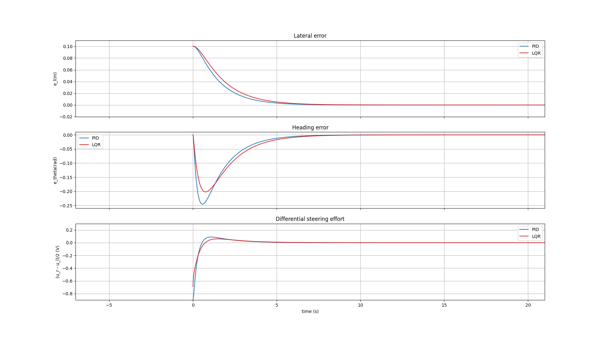 | 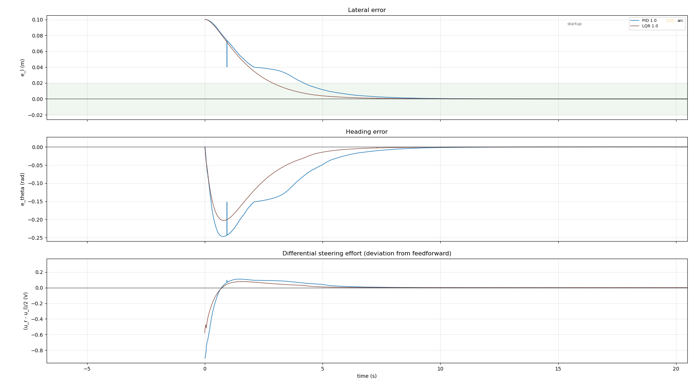 |

One difference remains: under Gazebo the cascade PID shows a small lateral overshoot mid-convergence, absent from the idealised linear model that runs the same control law. Reproducing Gazebo's discrete sampling does not reproduce the overshoot. The likely cause, therefore, lies in a higher-fidelity effect that the linear model does not account for, rather than in the discretization of the loop, isolating it is left as future work. This is stated as an open point, not a conclusion.

---
## Results and Robustness methodology

The comparison runs in two steps. The first establishes who tracks better when the model is trusted, the second establishes who survives when it isn't.

**Step 1: nominal.** Design model and simulation model are identical (J = 2.5×10⁻⁴, R = 5 Ω). Both controllers are tuned on that model and run on it.
Compare mean/max tracking error, convergence time and RMS command effort.

**Step 2: robustness with inertia.** Freeze the gains from step 1 then mismatch the least-reliable parameters **in the simulation model only**: the controller still believes J = 2.5×10⁻⁴ while the physics uses a different value. Re-run and measure how far each controller falls from its own step-1 baseline.

All runs are one full lap of the stadium, gains frozen on the nominal model, only the plant inertia `J` varied. Metrics are per-phase RMS; the startup phase is the initial convergence from `e_l₀ = 0.1 m`.

### Robustness - Nominal (J = 1)

On the nominal model the two controllers are **indistinguishable on tracking accuracy** and differ only on control effort.

| Metric (J = 1) | PID | LQR |
|---|---|---|
| `e_l` RMS — straights (mm) | 0.2–0.3 | 0.3 |
| `e_l` RMS — arcs (mm) | 1.7 | 2.0 |
| `e_theta` RMS — startup (mrad) | 55.5 | 51.7 |
| `e_theta` RMS — arcs (mrad) | 2.5–2.6 | 2.6 |
| differential effort RMS — startup (V) | 0.068 | **0.049** |
| differential effort RMS — straight (V) | 0.006 | **0.002** |

Sub-mm and sub-milliradian gaps on error → not significant. The one consistent difference is **effort: the LQR reaches the same accuracy with less differential command**.

<p align="center">
  
</p>

*Startup convergence (aligned on the arc entry): The PID (blue) shows a slight lateral overshoot mid-convergence; the heading-error plateau is that overshoot mirrored through the intermediate `theta_ref`.*


### Robustness — inertia sweep (J ×0.5 → ×10)

| Start | Straight-Arc-Straight-Arc-Strait |
|:---:|:---:|
| 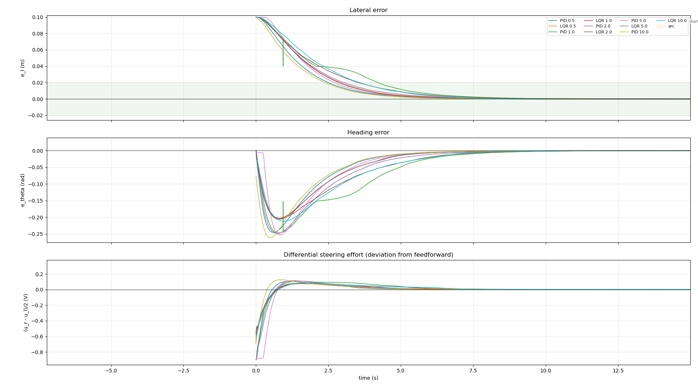 | 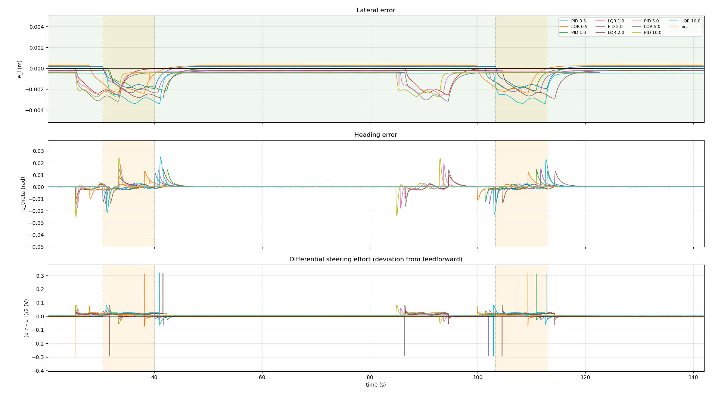 |


The degradation has a clean structure once read per phase:

#### Lateral error — `e_l` RMS per phase (mm)   ·   cell = PID / LQR

| phase | J=0.5 | J=1 | J=2 | J=5 | J=10 |
|---|---|---|---|---|---|
| startup    | 21.4 / 22.6 | 19.3 / 21.2 | 19.5 / 22.4 | 21.6 / 21.2 | 18.3 / 20.7 |
| arc 1      | 1.5 / 1.8   | 1.7 / 2.0   | 2.0 / 2.4   | 2.2 / 2.6   | 2.4 / 2.9   |
| straight 1 | 0.3 / 0.3   | 0.2 / 0.3   | 0.3 / 0.4   | 0.4 / 0.5   | 0.4 / 0.5   |
| arc 2      | 1.6 / 1.8   | 1.7 / 2.0   | 1.9 / 2.3   | 2.1 / 2.6   | 2.3 / 2.9   |
| straight 2 | 0.3 / 0.4   | 0.3 / 0.4   | 0.4 / 0.5   | 0.5 / 0.6   | 0.5 / 0.6   |

#### Heading error — `e_theta` RMS per phase (mrad)   ·   cell = PID / LQR

| phase | J=0.5 | J=1 | J=2 | J=5 | J=10 |
|---|---|---|---|---|---|
| startup    | 61.5 / 54.6 | 55.5 / 51.7 | 56.1 / 52.8 | 56.2 / 52.1 | 56.8 / 52.0 |
| arc 1      | 2.6 / 2.8   | 2.5 / 2.6   | 2.9 / 3.0   | 3.3 / 3.4   | 4.8 / 4.5   |
| straight 1 | 1.1 / 1.2   | 1.1 / 1.1   | 1.2 / 1.3   | 1.5 / 1.4   | 1.9 / 2.1   |
| arc 2      | 2.7 / 2.7   | 2.6 / 2.6   | 2.8 / 2.9   | 3.4 / 3.6   | 4.7 / 4.8   |
| straight 2 | 1.5 / 1.7   | 1.7 / 1.6   | 1.7 / 1.8   | 2.2 / 1.9   | 2.6 / 2.7   |

#### Differential steering effort — RMS per phase (mV)   ·   cell = PID / LQR

| phase | J=0.5 | J=1 | J=2 | J=5 | J=10 |
|---|---|---|---|---|---|
| startup    | 74 / 52   | 68 / 49   | 70 / 52   | - / 51    | 50 / 48   |
| arc 1      | 17 / 17   | 19 / 18   | 21 / 22   | 24 / 23   | 29 / 26   |
| straight 1 | 2 / 4     | 2 / 1     | 2 / 4     | 4 / 3     | 5 / 6     |
| arc 2      | 17 / 17   | 19 / 18   | 22 / 22   | 24 / 24   | 27 / 28   |
| straight 2 | 6 / 6     | 6 / 2     | 3 / 3     | 5 / 4     | 6 / 6     |

- **Straights are immune to `J`.** Lateral-error RMS stays at 0.3–0.6 mm across the whole sweep (in steady rectilinear motion the motor dynamics no longer matter).
- **Arcs concentrate the degradation.** The dynamic phases are where mis-estimated inertia bites.

| Arc `e_l` RMS (mm) | J=0.5 | J=1 | J=2 | J=5 | J=10 |
|---|---|---|---|---|---|
| PID | 1.5 | 1.7 | 2.0 | 2.2 | 2.4 |
| LQR | 1.8 | 2.0 | 2.4 | 2.6 | 2.9 |

Arc lateral error grows **by ×1.6** between J=0.5 and J=10 (heading error by ×1.8), for both controllers. **Even at a 10× inertia error, arc lateral-error RMS reaches only ~2.9 mm — roughly 7× below the 2 cm band.** The design margin fully absorbs the documented ×10 uncertainty on `J`. The LQR degrades marginally faster on the arcs (~20 % higher at J=10), but the absolute gap is negligible.

<p align="center">
  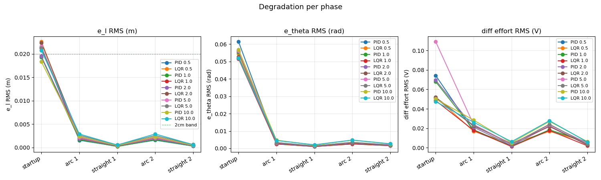
</p>
*Per-phase RMS across the sweep. Startup and arcs carry the degradation; straights are flat.*

### Conclusion — PID vs LQR under inertia uncertainty

**On the nominal model**, PID and LQR achieve equivalent tracking accuracy across the whole geometry. The one consistent difference is control effort, where the LQR is lower.

**Under a 10× inertia sweep** with frozen gains, **both controllers remain robust**: lateral error stays ~7× inside tolerance across the whole range. Robustness to inertia error therefore **does not discriminate** between the two. The choice rests elsewhere: control effort (LQR lower), tuning cost (LQR: `Q`/`R` weights + Riccati solve, vs PID: manual cascade tuning), and interpretability (the PID cascade explicitly bounds the intermediate heading command).

---

## Repository structure

```
.
├── README.md
├── CMakeLists.txt
├── package.xml
├── urdf/     duckiebot.xacro   (model + Gazebo params + ros2_control contract)
├── src/      path_error_node.cpp · lqr_controller_node.cpp · pid_controller_node.cpp
├── scripts/  motor_node.py
├── result/   PIDvsLQR/ Jtest/
├── python_simulation/
    ├── compute_matrices.py            ← builds A, B; runs the sanity checks
    ├── pid.py                         ← PID simulation
    ├── lqr.py                         ← LQR Gain and simulation
├── launch/ gazebo · control · display
└── docs/
    ├── platform_constraints.md        ← measured/estimated platform params, full traceability
    ├── system_model.md                ← kinematics + coupled motor dynamics derivation
    ├── requirements.md(soon)          ← posed requirements + their role in the study
    ├── README.md                      ← node-level implementation doc
└── config/ robot_params · lqr_params · pid_params · controller_config · scenario
```

---

## Running the ROS 2 simulation

Ubuntu 22.04 · ROS 2 Humble · Gazebo Classic 11 · `gazebo_ros_pkgs`, `gazebo_ros2_control`.

```bash
cd ros2_ws
colcon build --packages-select duckiebot
source install/setup.bash
```

Three terminals, workspace sourced in each:

```bash
# 1 — physics + ros2_control
ros2 launch duckiebot gazebo.launch.py

# 2 — control loop (estimator + controller + motor); pick the controller
ros2 launch duckiebot control.launch.py controller:=lqr    # or controller:=pid

```

---

## Documentation

| Document | What's in it |
|---|---|
| [`requirements.md`](requirements.md) | The requirements posed for the study and their stated role |
| [`platform_constraints.md`](docs/platform_constraints.md) | Every platform parameter with source, derivation, uncertainty, discarded alternatives |
| [`system_model.md`](docs/system_model.md) | Kinematics, coupled motor dynamics, state-space assembly, sanity checks |
| [`README.md`](docs/README.md) | ROS 2 node architecture, timing, config — the implementation layer |

---

## Roadmap

- **MPC** as a third controller on the same model
- **Port to real hardware** — the physical Duckiebot, with sim-vs-real gap analysis
- **Camera-based drift correction** — the line-tracking with camera

---

<sub>Mechatronics / control systems portfolio project · differential-drive path tracking · PID vs LQR.</sub>