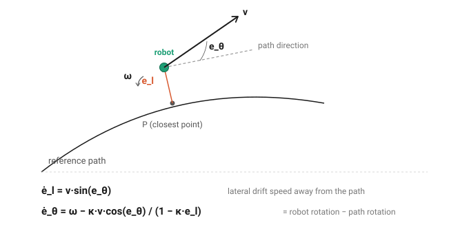

# System Model — Duckiebot Differential Drive

Model used for the PID vs LQR comparison in Python simulation (V1).
Builds on `requirements.md`(soon) and `platform_constraints.md`.

## 1. Scope and accepted assumptions

- Voltage command (PWM).
- Physical sensors available: encoder (odometry) and camera (lateral + heading error relative to the line, via a computer-vision algorithm). **In V1, only the encoder feeds the control loop**; odometry stays on the robot in V2, and the camera is added, not a replacement. See section 7 for the details of both measurements and the upcoming `sensor_analysis.md` for the velocity estimator.
- L ≈ 0: structural assumption, justified by the small motor + high gear ratio (1:48). Electrical model reduced to first order.
- R ≈ 5 Ω: set by order of magnitude by comparison with other motors of this type. Treated as a robustness-test parameter, not a fixed value.
- Ke = Kt = 0.478 (SI, wheel side), computed at no load, not corrected for R.

## 2. Differential kinematics

Convention: everything on the wheel side (post-gearbox), cf.`platform_constraints.md`.

**Geometric parameters**: wheel radius r = 3.3 cm, track width L = 10.2 cm.

**Forward** (wheel speeds → robot velocity):

    v = r·(ω_L + ω_R) / 2
    ω = r·(ω_R − ω_L) / L

**Pose integration**:

    ẋ = v·cos(θ)
    ẏ = v·sin(θ)
    θ̇ = ω

**Inverse**:

    ω_L = (v − ω·L/2) / r
    ω_R = (v + ω·L/2) / r

## 3. Motor dynamics (per wheel)

Quasi-static electrical equation (L neglected):

    V = R·i + Ke·ω

Mechanical equation:

    J·ω̇ = Kt·i − b·ω − τ_load

Substituting i:

    ω̇ = −(Kt·Ke)/(J·R)·ω − b/J·ω + Kt/(J·R)·V − τ_load/J

**Model parameters**:
- **J** (inertia reflected to the wheel side: rotor + gearbox + wheel), **set: J ≈ 2.5×10⁻⁴ kg·m²** (geometric computation, dominated by the reflected rotor ×N², derivation in `platform_constraints.md`). Least reliable parameter in the model → priority #1 for the robustness test.
- **b** (viscous friction) — **decided: b = 0 in V1**. Not measurable (same datasheet dead-end as R); b is probably negligible compared with the electrical damping, based on typical orders of magnitude for this type of motor.

## 4. Motor ↔ chassis coupling — τ_load

A **rigorous model (rigid, 2 driven wheels)** would couple the two wheels through the total mass and the chassis yaw inertia:

    Linear (Newton): m·v̇ = F_L + F_R
    Rotational:      I_z·ω̇ = (L/2)·(F_R − F_L)

**Simplification**: neglect the rotational coupling term (I_z) and treat each wheel as independently driving half the total mass. This amounts to adding an equivalent inertia to J:

    J_eq = J_motor+gearbox+wheel + (m/2)·r²

## 5. State space — proposal

**Inputs**: u = [V_L, V_R] (voltage applied to each wheel).

**Chosen state**:

    x = [e_l, e_θ, ω_L, ω_R]

where e_l = lateral error to the reference path, e_θ = heading error, ω_L, ω_R = wheel speeds.

Linearization about a constant reference speed v_r (nominal trajectory):

    ẋ = A·x + B·u

### Chosen option

- **error in the moving frame** (e_l, e_θ): standard for trajectory tracking, clean linearization about a constant-speed operating point.

## 6. Equation of motion — full assembly

Goal: ẋ = f(x, u) for x = [e_l, e_θ, ω_L, ω_R], u = [V_L, V_R].

*The robot (green) is offset by e_l from the closest point P on the path, and its heading is tilted by e_θ relative to the path direction (dashed).*

**Error kinematics block** — from v, ω (section 2):

    ė_l = v·sin(e_θ)
    ė_θ = ω − κ·v·cos(e_θ)/(1 − κ·e_l)

where κ is the curvature of the reference path (known in advance, a property of the path, not of the robot). The (1−κ·e_l) factor comes from the fact that the robot, offset by e_l, does not travel the same distance as the corresponding point on the path for the same turn.

**Coupled motor dynamics block** (sections 3-4). Starting point, the two motor equations after substituting the current (section 3):

    J·ω̇_L = (Kt/R)·V_L − (Kt·Ke/R)·ω_L − τ_load,L
    J·ω̇_R = (Kt/R)·V_R − (Kt·Ke/R)·ω_R − τ_load,R

The load torque couples the two wheels through the mass and the yaw inertia (section 4). Setting α = m·r²/4 and β = I_z·r²/L², expanding F_L, F_R gives:

    τ_load,L = (α+β)·ω̇_L + (α−β)·ω̇_R
    τ_load,R = (α−β)·ω̇_L + (α+β)·ω̇_R

Substituting back and grouping all ω̇ terms on the left:

    (J+α+β)·ω̇_L + (α−β)·ω̇_R = (Kt/R)·V_L − (Kt·Ke/R)·ω_L
    (α−β)·ω̇_L + (J+α+β)·ω̇_R = (Kt/R)·V_R − (Kt·Ke/R)·ω_R

The left-hand side is M·[ω̇_L; ω̇_R]:

    M = [ J+α+β   α−β  ]
        [ α−β    J+α+β ]

Isolating the accelerations by multiplying by M⁻¹:

    [ω̇_L; ω̇_R] = A_ω·[ω_L; ω_R] + B_ω·[V_L; V_R]

with **A_ω = −(Kt·Ke/R)·M⁻¹** and **B_ω = (Kt/R)·M⁻¹**.

**Linearization** about (e_l=0, e_θ=0, v=v_r, κ=κ_r):

    ė_l ≈ v_r·e_θ
    ė_θ ≈ (r/L)(ω_R−ω_L) − κ_r·v_r

The constant term −κ_r·v_r does not depend on x: it is a feedforward (cancelled by the nominal setpoint ω_ref = κ_r·v_r), not an input of the linearized system; it appears in neither A nor B.

**A and B — symbolic form**:

    A = [ 0    v_r   0      0    ]        B = [ 0      0    ]
        [ 0    0    −r/L   r/L  ]            [ 0      0    ]
        [ 0    0    A_ω11  A_ω12]            [ B_ω11  B_ω12]
        [ 0    0    A_ω21  A_ω22]            [ B_ω21  B_ω22]

**A and B — numerical values** (Kt=Ke=0.478; R=5 Ω; J=2.5×10⁻⁴; m=1 kg; r=0.033 m; I_z=4.1×10⁻³; L=0.102 m; v_r=0.2 m/s):

    A = [  0     0.2      0        0     ]    B = [   0        0     ]
        [  0     0       −0.324    0.324 ]        [   0        0     ]
        [  0     0      −49.4     −8.14  ]        [ 103.3     17.0   ]
        [  0     0       −8.14    −49.4  ]        [  17.0    103.3   ]

reproducible via `compute_matrices.py`.

**Sanity checks**:

1. **Motor time constants: 17 and 24 ms** (eigenvalues of the motor block: −57.5 and −41.2 s⁻¹). Consistent with a small geared motor, and **validates L≈0 a posteriori**: even L=1 mH would give τ_elec=L/R=0.2 ms, ~100× faster → the electrical pole is indeed outside the bandwidth.

2. **Controllability: rank 4/4.** Fully controllable system, a necessary condition for LQR. A rank <4 would have flagged a state not steerable by the voltages.

3. **e_l, e_θ columns null in A**: expected, no natural restoring force toward the path in open loop. That is the controller's role.

## 7. Observation — what each sensor measures

**Encoder (odometry)** — used in V1:

    y_odo = h_odo(x) = [ω_L, ω_R]

Directly the last two state components. e_l and e_θ are *not* measured directly: they are reconstructed by integrating the kinematics (section 2) from ω_L, ω_R and a known initial pose, hence subject to drift (accumulating odometry error), to be handled in `sensor_analysis.md`.

**Camera (line following)** — out of the loop in V1, modeled so as not to lose the end goal:

    y_cam = h_cam(x) = [e_l, e_θ]

Direct measurement, no integration and no drift, but available only when the camera is active.

**In V1**: only y_odo enters the estimator and the closed loop. y_cam is documented here as the target measurement for V2 (fusion to be designed later, not a plain replacement. The encoder stays useful in V2 for its higher rate during camera line-of-sight losses).